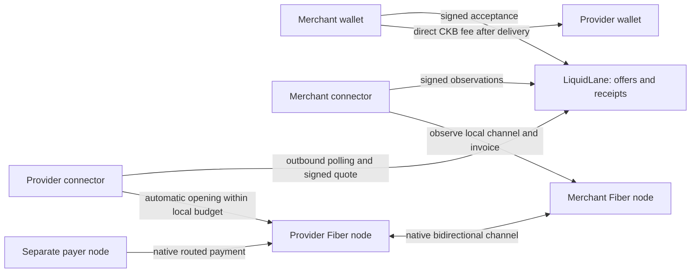

# Marketplace design and custody

LiquidLane sells an initial amount of usable Fiber receive capacity on CKB testnet. It coordinates an opening service; there is no duration guarantee, automatic replenishment, passive LP deposit, platform fee, or promised return.

## Signing authority

| Component | Holds / authorizes | Cannot authorize through the marketplace |
| --- | --- | --- |
| Provider Fiber node | Its CKB wallet, channel keys, current channel state; native funding and closure | Merchant spending |
| Provider connector | Local node identity key, restricted pairing token, durable opening journal | Arbitrary coordinator-selected RPC calls, outgoing payments, or closing destinations |
| Merchant Fiber node | Receiving channel keys/state, invoices, earned balances | Provider's other wallet/channel balances |
| Merchant wallet | Login proof, quote acceptance, direct fee transaction | Provider channel funding |
| Coordinator | Hashed sessions, pairing challenges, offers, quotes, evidence, audit events | Channel signatures, wallet spending, or unilateral access to node RPC |

The connector runs in the node operator's trust boundary. Local RPC access is powerful even though its coordinator-facing protocol is narrow. Compromising that machine, replacing its executable/policy, or losing its keys/state is outside the coordinator isolation guarantee. The coordinator executable does not load connector configurations or private keys.

## Pinned native integration

- Fiber **v0.9.0**, commit `e6cb7ac7770b1798a1ad5dfb9a8f4ae5db52036f`; both server and connector reject another version.
- Testnet genesis: `0x10639e0895502b5688a6be8cf69460d76541bfa4821629d86d62ba0aae3f9606`.
- Native funding lock: `0x6c67887fe201ee0c7853f1682c0b77c0e6214044c156c7558269390a8afa6d7c`, `type`, 20-byte arguments.
- Node RPC remains on loopback. Pairing binds wallet ownership to a node-identity signature and full TCP peer address. Re-pairing rotates its bearer token.
- `open_channel` uses `one_way=false`, explicit public/private visibility, native CKB, and the node's own default funding/closing lock.
- A quote for **500 CKB** requests **600 CKB** from the provider: 500 initial usable capacity + 99 native reserve + 1 probe headroom. The receiving node ordinarily supplies its own 99 CKB reserve. Fresh heartbeat reports determine its exact configured contribution.
- Both wallets also need change and transaction fees. Scheduling leaves a conservative 63 CKB wallet buffer; this is an availability constraint, not a platform charge.
- v0.9.0 `remote_balance` already excludes the channel reserve. Merchant usable inbound is `remote_balance - received_tlc_balance`; do not subtract the reserve twice.
- A private channel requires known routing information. The demonstrated three-node route uses public channels. The marketplace does not invent route hints or promise arbitrary-payer reachability for private channels.

The API was checked against [pinned channel types](https://github.com/nervosnetwork/fiber/blob/v0.9.0/crates/fiber-json-types/src/channel.rs) and [channel implementation](https://github.com/nervosnetwork/fiber/blob/v0.9.0/crates/fiber-lib/src/fiber/channel.rs), alongside the [native channel reference](https://www.fiber.world/docs/api-reference/channels/channel).

## Offers, authorization, and delivery

Offers expire after 24 hours; quotes expire after 10 minutes. A provider connector signs the immutable quote and the merchant signs its hash. New provider setups authorize public requests automatically under explicit local funding and fee limits. The quote binds both participants/nodes, recipient, capacity, funding, reserves, fee, visibility, expiry, and nonce. The deadline governs starting the opening; submitted funding is reconciled even after that deadline.

Signed heartbeats report the provider's automation mode, funding limits, minimum fee, and committed channel funding. Listings and order reservations respect that budget as well as wallet availability. SQLite immediately reserves funding when a request is created. The connector independently rechecks the actual wallet and all local channels; opening commitments remain budgeted even after payments move their balances. A local worker lock prevents overlapping cycles in one state directory, and an unresolved previous opening prevents another submission. Cancellation ends before execution is claimed. An uncertain opening keeps its reservation and journal; it is never blindly repeated. Run one connector configuration per Fiber node and preserve its state directory.

Delivery requires committed native funding, fresh signed observations from both nodes with matching channel/outpoint and balances, enough merchant-observed inbound capacity, and a merchant invoice reported `Paid` after a real probe. The signed observations and approvals are retained in an exportable receipt.

These are participant attestations. CKB funding proves an output exists; it does not prove current off-chain balances or future availability. A merchant's invoice status alone does not cryptographically prove the entire route. The testnet evidence additionally records a separate payer, the only two route channels, and their balance changes. The service neither labels arbitrary provider claims as verified nor claims trustless off-chain auditing.

## Fee policy

The opening fee is paid directly to the provider **after verified delivery**. Providers serve any merchant in automatic mode and knowingly bear nonpayment risk, bounded by their local funding limits. Core blocks another outstanding/unpaid order for that merchant/provider pair. A merchant can use another wallet; this rule is not Sybil resistance or payment enforcement. Automatic connection does not guarantee fee collection.

Core requires an exact recipient/amount, empty-data native output, a merchant-owned input, a committed transaction after the delivery block anchor, and a globally unique payment transaction. Paid status is idempotent. The direct recipient cell imposes a minimum fee: 61 CKB for a standard 20-byte lock, more for larger wallet locks. This testnet mechanism is deliberately simple and is not an economic recommendation for a mainnet opening fee.

Unpaid fees become overdue after 24 hours. The provider may explicitly waive a fee. Failed openings incur no opening fee. Disputes and any voluntary refund are resolved between participants using the signed receipt; the coordinator cannot debit wallets, claw back merchant earnings, or promise automatic compensation. Early closure is recorded in channel observations while the original delivery/fee history remains intact.

## Threat cases

| Case | Enforced boundary / remaining trust |
| --- | --- |
| Malicious coordinator changes amount, peer, fee recipient, or expiry | Independent provider/merchant signatures and local policy reject the modified order. Automation cannot bypass local funding limits. |
| Duplicate delivery or fee reference | Canonical funding references and unique transaction bindings reject reuse; journal refuses another opening attempt. |
| Coordinator disappears | Existing native payments and direct closure remain available. Discovery and monitoring become unavailable. |
| Provider lies about delivery | Provider-only evidence cannot mark the order delivered; merchant observation and probe are required. Both parties can still collude about off-chain facts. |
| Stolen pairing/session token | Token scopes restrict account vs node operations; node mutations also require its identity signature. Pairing expires and is single use. Re-pairing revokes the old node token. |
| JoyID identity proof | Verify P-256/RSA signatures, WebAuthn origin/RP/challenge/presence, and fixed testnet credential-server binding. Credential registration depends on JoyID's service availability and correctness; native CKB proofs bind directly to the address script. |
| A peer goes offline | Native unilateral close and watchtower/settlement rules apply. `Closed` does not imply spendable funds. No coordinator override shortens protocol timelocks. |
| Old backup restored | Do not automatically force close. Preserve current state and use native recovery guidance; a stale commitment can be penalized. |

Provider value can move into incoming channels through routing. Recovery reconciles the provider's whole channel portfolio, while received payments belong to the merchant. See [Fiber's lifecycle](https://www.fiber.world/docs/concept/channels/channel-lifecycle). Guaranteed lease duration remains separate enforcement work described by [Fiber's liquidity research](https://www.fiber.world/blog/p/liquidity_solutions).
